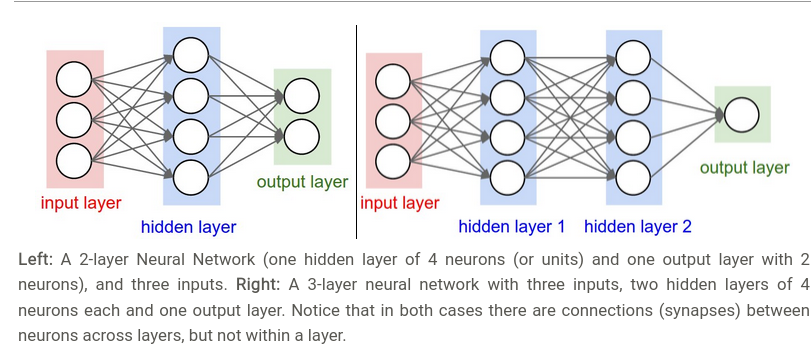

# Complete solutions for all the assignments in the Stanford CS231n course.

This overview contains a dedicated section for each assignment, listing the main topics covered in it together with links to the notebooks where that topic is used. Additionally, each sub-section contains a "Topics Index" which aims to give a more in depth intuitive explanation of the most important topics covered in the assignment. This part also lists the core implementation section in the assignment relevant for that topic as well as relevant readings on the topic (either extracted from the notes or not) that can be useful in gaining more context or a better understanding of the topic.

## Assignment 1 - [Solutions Directory](./Assignments/assignment1/)

* Q1 - [k-Nearest Neighboor Classifier](./Assignments/assignment1/knn.ipynb)
* Q2 - [Training a Support Vector Machine](./Assignments/assignment1/svm.ipynb)
* Q3 - [Train a Softmax Classifier](./Assignments/assignment1/softmax.ipynb)
* Q4 - [Train a Two Layer Fully Connected Neural Network](./Assignments/assignment1/two_layer_net.ipynb)
* Q5 - [Higher Level Representations: Image Features](./Assignments/assignment1/features.ipynb)

## Assignment 2 - [Solutions Directory](./Assignments/assignment2/)

* Q1 - [Multi Layer Fully Connected Neural Networks](./Assignments/assignment2/FullyConnectedNets.ipynb)
* Q2 - [Batch Normalization](./Assignments/assignment2/BatchNormalization.ipynb)
* Q3 - [Dropout](./Assignments/assignment2/Dropout.ipynb)
* Q4 - [Convolutional Neural Networks](./Assignments/assignment2/ConvolutionalNetworks.ipynb)
* Q5 - [Pytorch on CIFAR10](./Assignments/assignment2/PyTorch.ipynb)

## Assignment 3 - [Solutions Directory](./Assignments/assignment3/)

* Q1 - [Network Visualization](./Assignments/assignment3/Network_Visualization.ipynb)
* Q2 - [Image Captioning with Vanilla RNNs (Recurrent Neural Networks)](./Assignments/assignment3/RNN_Captioning.ipynb)
* Q3 - [Image Captioning with LSTMs (Long Short Term Memory Networls)](./Assignments/assignment3/LSTM_Captioning.ipynb)
* Q4 - [Image Captioning with Transformers](./Assignments/assignment3/Transformer_Captioning.ipynb)
* Q5 - [GANs (Generative Adversial Networks)](./Assignments/assignment3/Generative_Adversarial_Networks.ipynb)
* Q6 - [Self Supervised (Contrastive) Learning](./Assignments/assignment3/Self_Supervised_Learning.ipynb)

## Topics Index

| Topic                                          | Relevant Reading / Figures                                                                                                                                                                                                                                                                                                                                                                                                                                                                                                                                                                                                                                                                                                                                                                                                                                                                                                                                                                                                                                                                    | Brief Intuitive Explanation                                                                                                                                                                                                                                                                                                                                                                                                                                                                                                                                                                                                                                                                                                                                                                                                                                                                                                                                                                                                                                                                                                                                                                                                                                                                                                                                                                                                                                                                                                                                                                                                                                                                                                                                                                                                                                                                                                                                                                                                                                                                                                                                                                                                                                                                                                                                                                                                                                                                                                                                                                                                                                                                                                                                                                                                                                                                                                                                                                                                                                                                                                                                                                                                                                                                                                                                                                                                                                                                              | Implemented / Visualization                                                                                |
| :--------------------------------------------- | :----------------------------------------------------------------------------------------------------------------------------------------------------------------------------------------------------------------------------------------------------------------------------------------------------------------------------------------------------------------------------------------------------------------------------------------------------------------------------------------------------------------------------------------------------------------------------------------------------------------------------------------------------------------------------------------------------------------------------------------------------------------------------------------------------------------------------------------------------------------------------------------------------------------------------------------------------------------------------------------------------------------------------------------------------------------------------------- | :------------------------------------------------------------------------------------------------------------------------------------------------------------------------------------------------------------------------------------------------------------------------------------------------------------------------------------------------------------------------------------------------------------------------------------------------------------------------------------------------------------------------------------------------------------------------------------------------------------------------------------------------------------------------------------------------------------------------------------------------------------------------------------------------------------------------------------------------------------------------------------------------------------------------------------------------------------------------------------------------------------------------------------------------------------------------------------------------------------------------------------------------------------------------------------------------------------------------------------------------------------------------------------------------------------------------------------------------------------------------------------------------------------------------------------------------------------------------------------------------------------------------------------------------------------------------------------------------------------------------------------------------------------------------------------------------------------------------------------------------------------------------------------------------------------------------------------------------------------------------------------------------------------------------------------------------------------------------------------------------------------------------------------------------------------------------------------------------------------------------------------------------------------------------------------------------------------------------------------------------------------------------------------------------------------------------------------------------------------------------------------------------------------------------------------------------------------------------------------------------------------------------------------------------------------------------------------------------------------------------------------------------------------------------------------------------------------------------------------------------------------------------------------------------------------------------------------------------------------------------------------------------------------------------------------------------------------------------------------------------------------------------------------------------------------------------------------------------------------------------------------------------------------------------------------------------------------------------------------------------------------------------------------------------------------------------------------------------------------------------------------------------------------------------------------------------------------------------------------------------------- | :------------------------------------------------------------------------------------------ |
| kNN  Classifier                                | + [cs231n notes](https://cs231n.github.io/classification/)  + [A Few Useful Things to Know About Machine Learning](https://homes.cs.washington.edu/~pedrod/papers/cacm12.pdf)  + [Recognizing and Learning Object Categories](https://people.csail.mit.edu/torralba/shortCourseRLOC/index.html)  +[kNN classification using Neighbourhood Components Analysis](https://kevinzakka.github.io/2020/02/10/nca/)  +[PCA (Principal Component Analysis) and SVD(Singular Value Decomposition)](https://web.archive.org/web/20150503165118/http://www.bigdataexaminer.com:80/understanding-dimensionality-reduction-principal-component-analysis-and-singular-value-decomposition/)  +[Random Projections](https://scikit-learn.org/stable/modules/random_projection.html)  +[Approximate Nearest Neighboor Classifier - FLANN](https://github.com/mariusmuja/flann)                                                                                                                                                                                                     | **Training** - This step can be replaced with storing all the available training data. k is hyperparameter that needs to be tuned on the validation data.     **Inference** - The sample to classify is compared to all the available training samples by computing L1 norm ($d_1(I_1, I_2) = \sum_{p} \left\lVert I^p_1 - I^p_2 \right\rVert$) or L2 norm ($d_2 (I_1, I_2) = \sqrt{\sum_{p} \left( I^p_1 - I^p_2 \right)^2}$). The classifier assigns to the inference sample the most common class of the k training samples with the lowest distance to the inference sample.                                                                                                                                                                                                                                                                                                                                                                                                                                                                                                                                                                                                                                                                                                                                                                                                                                                                                                                                                                                                                                                                                                                                                                                                                                                                                                                                                                                                                                                                                                                                                                                                                                                                                                                                                                                                                                                                                                                                                                                                                                                                                                                                                                                                                                                                                                                                                                                                                                                                                                                                                                                                                                                                                                                                                                                                                                                                                                                   | [k_nearest_neighbor.py](./Assignments/assignment1/cs231n/classifiers/k_nearest_neighbor.py) |
| SVM Classifier                                 | + [cs231n notes - Multiclass SVM Formulation](https://cs231n.github.io/linear-classify/)  + [Inspiration paper for SVM formulation in the assignment](https://www.researchgate.net/publication/221166057_Support_Vector_Machines_for_Multi-Class_Pattern_Recognition)  + [OVA (One-VS-All) SVM Formulation](https://scikit-learn.org/stable/modules/generated/sklearn.multiclass.OneVsRestClassifier.html)  + [AVA (All-VS-All) SVM Formulation](https://www.csie.ntu.edu.tw/~cjlin/papers/multisvm.pdf)  + [Structured SVM Formulation](https://www.cs.cornell.edu/people/tj/publications/joachims_etal_09b.pdf)  + [Deep Learning using Support Vector Machines](https://arxiv.org/abs/1306.0239)                                                                                                                                                                                                                                                                                                                                                                   | **Training** - The training stage aims to minimize the error of the classifier by tweaking the model weights so that they simmultaneusly can achieve the lowest possible loss when classifying samples in the training dataset. The error(loss) is non-zero whenever the predicted score for a class is different than the score of the correct class for a sample. Additionally, a regularization term is commonly used to explicitly limit the complexity of the model and prevent over-fitting. Intuitively, the training stage aims to find support vectors to define decision boundaries inbetween classes such that the distance between the support vector and the closest points of the classes it separates has a value of at least $\Delta$. It is common for $\Delta$ to have a value of 1.    **Activation Function** - For the single sample case (at sampling/inference) it is defined as a vector matrix multiplication $f(x_i; W) =  W x_i$ where the vector $x_i$ contains the sample data and the matrix $W$ contains the model weights for all classes that the classifier needs to distinguish amongst. For the multi sample case (at training) it is defined as a regular matrix multiplication $f(X; W) =  W X$ where one matrix ($X$) contains data for multiple samples and the second matrix ($W$) contains the model weights similar to the previous case.    **Loss Function** - For a single sample the loss function is known as "Hinge Loss" and is computed as $L_i = \sum_{j\neq y_i} \max(0, s_j - s_{y_i} + \Delta)$. The overall loss function is computed as $L =  \underbrace{ \frac{1}{N} \sum_i L_i }_\text{data loss} + \underbrace{ \lambda R(W) }_\text{regularization loss} \\\\$ where $\lambda$ is the regularization strength hyperparameter and $R(W) = \sum_k\sum_l W_{k,l}^2$. In the regularization loss formula $W$ denotes the weight matrix of the SVM classifier and $N$ denotes the number of all training samples in the training dataset. The loss function commonly contains two components: the *data* loss and the *regularization* loss. The *data* loss penalizes errors with respect to the data while the *regularization* loss penalizes errors with respect to the model parameters.    **Inference** - With the trained classifier, a class is assigned to a test sample based on the scores computed from the equation $f(x_i; W) =  W x_i$ on that sample for each of the classes. The assigned class is the class with the highest computed score.                                                                                                                                                                                                                                                                                                                                                                                                                                                                                                                                                                                                                                                                                                                                                                                                                                                                                                                                                               | [linear_svm.py](./Assignments/assignment1/cs231n/classifiers/linear_svm.py)                 |
| Softmax Classifier                             | + [cs231n notes - Softmax Classifier](https://cs231n.github.io/linear-classify/)                                                                                                                                                                                                                                                                                                                                                                                                                                                                                                                                                                                                                                                                                                                                                                                                                                                                                                                                                                                                     | **Training** - Similarly to the SVM, the training stage aims to minimize the loss function. The main difference between the Softmax and the SVM classifiers arise in the interpretation of the scores obtained from the activation function and the definition of the loss function.    **Activation Function** - The activation function is defined identically to the SVM for both training and inference stages. However, the interpretation of the class scores for a sample is different. In this case the scores are interpreted as **unnormalized log probabilities**.    **Loss Function** - The loss function for this classifier is known as the "Cross-Entropy Loss" and is defined as $L_i = -\log\left(\frac{e^{f_{y_i}}}{ \sum_j e^{f_j} }\right) \hspace{0.5in} \text{or equivalently} \hspace{0.5in} L_i = -f_{y_i} + \log\sum_j e^{f_j}$ where $f_j$ is used to denote the $jth$ element in the vector of class scores $f$ and the function $f_j(z) = \frac{e^{z_j}}{\sum_k e^{z_k}}$ is known as the "Softmax Function". This function takes as input an array of real-values in an arbitrary range ($z$) and mapps it to an array of values between 0 and 1 that sum to 1 ($f(z)$). Intuitively, when minimizing the cross-entropy loss we aim to minimize the cross-entropy between the 2 distributions of data involved in its computation: the estimated class probabilities *predicted* by the model and the *real* class probabilities provided as labels. In other words, we can say that the cross-entropy objective wants the *predicted* distribution to have all of its mass on the correct answer. Similar to the SVM case, the loss function commonly contains two components: the *data* loss and the *regularization* loss. The *data* loss penalizes errors with respect to the data while the *regularization* loss penalizes errors with respect to the model parameters.     **Inference** - With the trained classifier, a class is assigned to a test sample based on the scores computed from the equation $f(x_i; W) =  W x_i$ on that sample for each of the classes. The assigned class is the class with the highest computed score.                                                                                                                                                                                                                                                                                                                                                                                                                                                                                                                                                                                                                                                                                                                                                                                                                                                                                                                                                                                                                                                                                                                                                                                                                                                                                                       | [softmax.py](./Assignments/assignment1/cs231n/classifiers/softmax.py)                       |
| Backpropagation: Gradient Based Learning       | + [Optimization: Stochastic Gradient Descent](https://cs231n.github.io/optimization-1/)  + [Backpropagation Intuitions](https://cs231n.github.io/optimization-2/)  + [Automatic differentiation in machine learning: a survey](https://arxiv.org/abs/1502.05767)  + [Vector, Matrix, and Tensor Derivatives](https://cs231n.stanford.edu/vecDerivs.pdf)  + [The Matrix Calculus You Need For Deep Learning](https://arxiv.org/abs/1802.01528)                                                                                                                                                                                                                                                                                                                                                                                                                                                                                                                                                                                                                            | **Intuition** - Gradient based learning implies that an objective function is defined. This objective is usually intended to measure the error of a model prediction. The model prediction is a function of model parameters and training data so naturally the objective function is going to be a function of model parameters and training data. Given that we want our model to have an error as low as possible we aim to minimize its error. In other words, we want to minimize the defined objective which measures how wrong the model prediction is. Since the data is fixed and we don't want it to change, we can achieve lower error by tweaking the model parameters. To know exactly how the model parameters should be tweaked to minimize the output of the objective we use its gradient. The gradient can be interpreted as the direction of the steepest ascent of the objective function but since we are interested in minmizing the objective we use its opposite value to update the model parameters. This enables us to find the decreasing direction of the objective function and update the model parameters along it to minimize the error.    **Gradient Computation** - Gradient of an expression can be computed either numerically (i.e. using the centered difference  formula) or analytically (using calculus rules). It is good practice to perform a gradient check after implementing the gradient function of an expression. This means evaluating both the numerical and analytical gradient expressions and comparing the results. We expect the results to be 0 (or at least in the order of $10^{-5}$). When dealing with intricate expressions it is common to decompose the expression into a "Circuit Diagram" and use the "Chain Rule" method to compute its gradient.    **Gradient Descent** - This reffers to the idea of computing the gradient of an expression and updating its parameters with the opposite of gradient value (when the goal is to minimize the objective value). It is common that the scaled gradient value is used for update and the scaling parameter is known as the "learning rate" which is a hyperparameter that needs to be tuned.                                                                                                                                                                                                                                                                                                                                                                                                                                                                                                                                                                                                                                                                                                                                                                                                                                                                                                                                                                                                                                                                                                                                                                                                                                                                         |                                                                                             |
| FCNN (Fully Connected Neural Networks) - Intro | + [cs231n notes 1](https://cs231n.github.io/neural-networks-1/)  + [ImageNet Classification with Deep Convolutional Neural Networks](http://www.cs.toronto.edu/~fritz/absps/imagenet.pdf)  + [Delving Deep Into Rectifiers: Surpassing Human-Level Performance on ImageNet Classification](https://arxiv.org/pdf/1502.01852)  + [Proof that Neural Networks with at least one hidden layer are universal approximators](http://neuralnetworksanddeeplearning.com/chap4.html)  +[Do Deep Nets Really Need to be Deep?](https://arxiv.org/abs/1312.6184)  +[FitNets: Hints for Thin Deep Nets](https://arxiv.org/abs/1412.6550)  +[The Loss Surfaces of Multilayer Networks](https://arxiv.org/abs/1412.0233)  + [deeplearning.net tutorial](http://www.deeplearning.net/tutorial/mlp.html)  + [ConvNetJS Demo](http://cs.stanford.edu/people/karpathy/convnetjs/)  + [Single Neuron Dynamics and Computation](https://www.sciencedirect.com/science/article/abs/pii/S0959438814000130)  + [cs231n notes 2](https://cs231n.github.io/neural-networks-2/)  + [Understanding the difficulty of training deep feedforward neural networks](https://proceedings.mlr.press/v9/glorot10a/glorot10a.pdf)  + [Dropout: A Simple Way to Prevent Neural Networks from Overfitting](http://www.cs.toronto.edu/~rsalakhu/papers/srivastava14a.pdf)  + [cs231n notes 3](https://cs231n.github.io/neural-networks-3/) - Contains a lot of valuable information and resources about training models from scratch.  + [Sofmtax Classifier vs FCNN: 2D Classification Example](https://cs231n.github.io/neural-networks-case-study/)    | **Intuition** - FCNNs (Fully Connected Neural Networks) can be seen as an extension of linear classifiers. Whereas a linear classifier would usually compute the class scores (i.e. $s$) as a linear mapping between data and model parameters (i.e. $s = W x$), FCNNs stack multiple linear mappings on top of each other containing nonlinear functions in-between them (i.e. $s = W_2 \max(0, W_1 x)$ for a 2 layer FCNN or $s = W_3 \max(0, W_2 \max(0, W_1 x)) for a 3 layer FCNN$). These nonlinearities are crucial because without them the resulting classifier would still be a linear one (only a more complex one since it is now made out of multiple classifiers stacked together rather than a single one). Intuitively, when considering about how can this computational structure find boundaries in a non-linear high dimensional space we can think of it as performing linear classification on multiple representations of the data until the data dimensionality is simple (low) enough that the linear classifier can actually find linear boundaries in-between classes. It is cruccial to mention that in this approach the samples processed by the FCNN are represented as unidimensional vectors (i.e. in the case of images, they will first have to be reshaped from a 3D tensor to a 1D vector) or matrices (if we're talking about entire data batches)    **Data Preprocessing** - The most common data preprocessing techniques are centering (mean subtraction), normalization (either by using standard deviation or by transforming the data to have values in the range [-1, 1] using an affine transformation). Although not used with CNNs, another form of data preprocessing is PCA(reducing the data dimensionality by selecting k dimensions with the most variance) and whitening(divide the data in its eigenbasis by its eigenvalues to squash the variance to the same length across all the dimensions)    **Activations Function** - There are multiple activation functions that can been used in this structure but by far the most common, proven and recommended one is the ReLU activation function which has the form $max(0,-)$. This function thresholds all values in the input that are below 0 to 0 and leaves all the other values unchanged. Other options of activation functions are: sigmoid, tanh, maxout and variations of ReLU such as LeakyReLU or GeLU.    **Loss Function** - Multiple loss functions can be used in combination with the FCNN structure such as *hinge loss* or *cross-entropy loss* among the simplest examples. More complex objective functions can be defined depending on the task at hand. The loss function commonly contains two components: the *data* loss and the *regularization* loss. The *data* loss penalizes errors with respect to the data while the *regularization* loss penalizes errors with respect to the model parameters.    **Regularization** - Is a form of counteraction to prevent the model from overfitting when training neural networks. Regularization can take multiple forms such as additional terms to the loss function itself (L1 or L2 regularization) or various techniques employed during training such as *max norm constraints* or *dropout*. Note that only the model weights are commonly regularized while the bias terms are not. Additionally, all model layers are regularized in a similar manner. It is uncommon to regularize different layers to different amounts. **Training** - During training the first step is to compute the forward pass of the model (the set of matrix multiplication followed by non-linearity multiple times depending on the number of layers in the model). The second step is to compute the value of the loss function to measure how wrong the model predictions were for each sample. To prevent **overfitting** we must add a regularization term to the loss function to penalize large values in the model parameters (this is similar to the regularization term for the SVM case). The next step is to figure out how to change the model parameters such that the loss function value gets minimized. This information is inferred from the gradient of the loss function with respect to the model parameters. Since the gradient indicates the direction of the steepest ascent of the loss function, we use its opposite value to update the model parameters (i.e. with values indicating towards the steepest descent) together with a scalar value known as learning rate to control the magnitude of the parameter update. | [fcnet.py](./Assignments/assignment1/cs231n/classifiers/fc_net.py)                                           |
|                                                |                                                                                                                                                                                                                                                                                                                                                                                                                                                                                                                                                                                                                                                                                                                                                                                                                                                                                                                                                                                                                                                                                      |                                                                                                                                                                                                                                                                                                                                                                                                                                                                                                                                                                                                                                                                                                                                                                                                                                                                                                                                                                                                                                                                                                                                                                                                                                                                                                                                                                                                                                                                                                                                                                                                                                                                                                                                                                                                                                                                                                                                                                                                                                                                                                                                                                                                                                                                                                                                                                                                                                                                                                                                                                                                                                                                                                                                                                                                                                                                                                                                                                                                                                                                                                                                                                                                                                                                                                                                                                                                                                                                                                          |                                                                                             |
